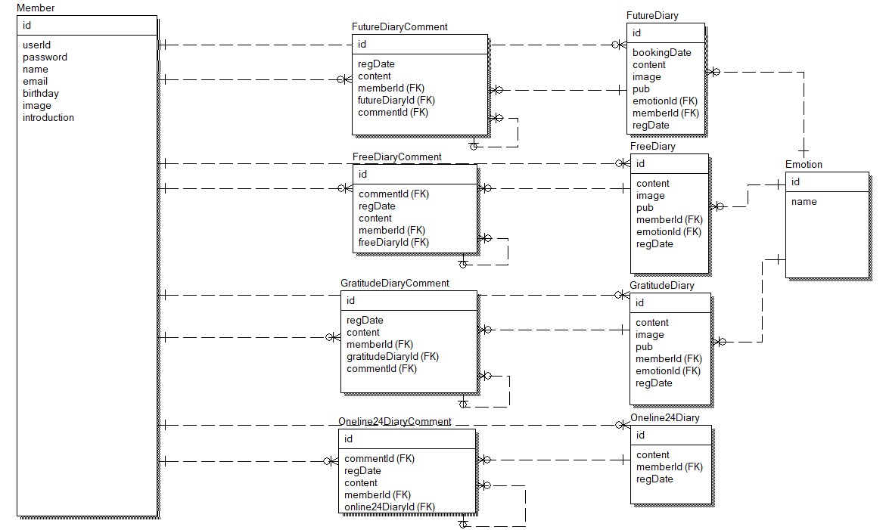
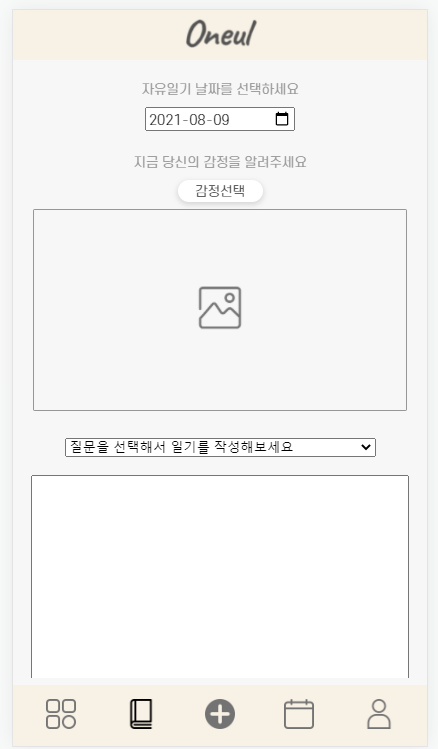
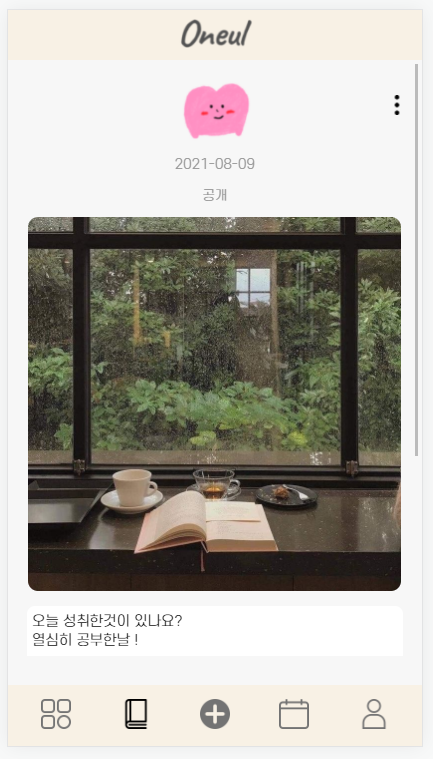
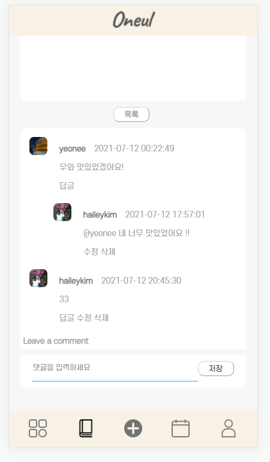
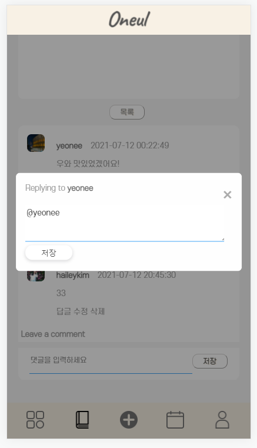

> 나의 하루를 정리하고 진정성있게 소통하는 공간
> 

목차 

## 1. 제작 기간 & 참여 인원

- 2021년 6월 10일 ~ 7월 12일
- 팀 프로젝트 총 6명

## 2. 사용 기술

### `Back-end`

- Java 8
- Spring Boot 2.3
- Maven
- MySQL 5.7
- Mybatis
- Thymeleaf
- AWS Cloud EC2 웹호스팅 [http://oneul.gonetis.com:8080/](http://oneul.gonetis.com:8080/)

### `Front-end`

- ES6
- HTML
- CSS

## 3. ERD 설계

## 4. 구현 기능 화면 캡쳐

제가 구현한 기능은 자유일기시스템 및 댓글시스템입니다.

사용자는 하루의 기분과 생각 및 사진을 기록 할 수 있고,  공개 여부를 통해 다른 사람들과 소통이 가능합니다.

### 4.1. 자유일기 목록 화면

- 사용자는 본인이 작성한 일기의 목록을 확인 할 수 있습니다.
- 첨부파일이 있는 일기의 경우 축소된 사진과 일기 내용이 간략히 표시됩니다.
- 댓글갯수와 일기 공개여부가 각 일기의 하단에 표시됩니다.

### 4.2. 자유일기 등록 화면

- 일기 등록시 현재 날짜가 기본으로 설정되며 희망하는 날짜 선택이 가능합니다.
- 각 일기별로 감정 이모티콘을 선택 할 수 있습니다.
- 사진을 첨부할 수 있으며 미리보기가 제공됩니다.
- 일기 작성을 돕기 위한 질문이 제공됩니다.
- 일기공개 여부를 선택하여 다른 사람들과 소통할 수 있습니다.

### 4.3. 자유일기 상세 화면

- 사용자가 등록한 일기의 상세내역입니다.
- 감정, 날짜,  사진, 내용 및 공개 여부를 확인 할 수 있습니다.
- 상세페이지 내 우측상단 버튼을 통해 수정 및 삭제가 가능합니다.
- 일기 내용 하단에는 각 일기의 댓글이 보입니다.

### 4.4. 댓글 목록

- 사용자는 공개되어있는 일기에 댓글을 남길 수 있습니다.
- 자신이 작성한 댓글에 수정,삭제 버튼이 활성화 됩니다.

### 4.5. 대댓글 등록 화면

- 사용자는 댓글의 댓글을 작성할 수 있습니다.
- 부모댓글의 댓글버튼을 누르면 대댓글 작성을 위한 팝업창이 생깁니다.

## 5. 구현 기능 흐름 및 구조

### 5.1. 전체 흐름

